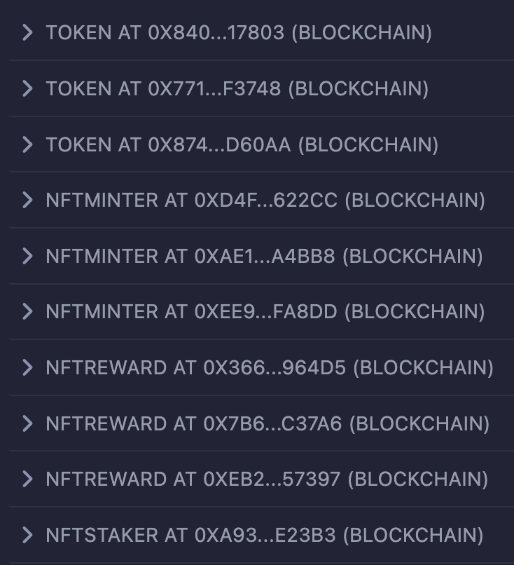

# NFT Staker

A dapp for staking NFTs.

## Smart Contracts

- Token (token_alpha, token_beta, token_gamma)
- NFTMinter (tom_and_jerry, mickey_mouse, scooby_doo)
- NFTReward (nft_reward_gold, nft_reward_silver, nft_reward_platinum)
- NFTStaker (nft_staker)

## Tools and Technologies Used

- nft:
  - IPFS, NFTs, Python
- contract:
  - Smart contracts (ERC20, IERC20, ERC721Enumerable, Ownable, ERC20Burnable, IERC721Receiver)
  - Hardhat, Ethers.js, Solidity, OpenZeppelin, Remix IDE, Ethereum, EVM (Ethereum Virtual Machine), Blockchain, Etherscan, JavaScript, Mocha Testcases, Solidity code coverage
- dapp:
  - React.js, Web3.js, Nginx, Metamask wallet
- Docker and Containers
- Ethernal dashboard - EVM compatible private blockchain network explorer.
- GitHub actions

## How To Run?

- [Upload NFTs to IPFS](./nft/.vscode/tasks.json)
- [Deploy smart contracts to the blockchain](./contract/.vscode/tasks.json)
- [Run the dapp](./dapp/.vscode/tasks.json)

## Workflow

1. Token [name, symbol, maxSupply, totalSupply, balanceOf (hash_wallet_accounts)]
2. NFTMinter [name, symbol, owner, baseURI, maxSupply, totalSupply, cost, customPaymentCurrencies, getCustomPaymentCurrencies]
3. NFTMinter [mint - with native token for user (not for owner)]
4. Token [balanceOf (user), approve (all balance tokens of user as an allowance to spend by NFTMinter smart contract), allowance], NFTMinter [mint - with custom token for user (not for owner)]
5. NFTMinter [totalSupply, balanceOf, walletOfOwner, tokenURI, ownerOf]
6. Token [balanceOf (NFTMinter smart contract and NFTMinter smart contract owner account)], NFTMinter [withdraw - native token balance AND custom token balance]
7. NFTReward [name, symbol, owner, maxSupply, totalSupply, balanceOf (owner account), controllers (NFTStaker smart contract)]
8. NFTStaker [owner, getVaults, vaults, totalStaked]
9. NFTMinter [setApprovalForAll (set NFTStaker smart contract as operator to handle all NFTs of a particular user account), isApprovedForAll]
10. NFTStaker [stake, totalStaked, totalStakesOf, stakedTokensOf, stakes]
11. NFTStaker [fetchReward (after creating a dummy transaction/block in the blockchain - like minting Token for a user), claim], NFTReward [balanceOf]
12. NFTStaker [unstake, totalStaked, totalStakesOf, stakedTokensOf, stakes], NFTMinter [ownerOf, walletOfOwner]
